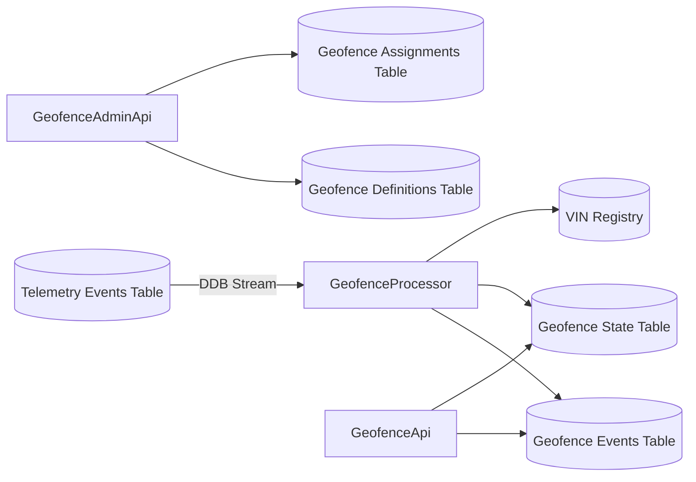

# Geofencing v1 (Serverless)

This module implements Geofencing v1 using DynamoDB, Lambda, and API Gateway, aligned with late-binding tenancy (VIN registry).

## Architecture



```mermaid
erDiagram
  GeofenceDefinitions {
    string PK
    string SK
    string geofenceId
    string tenantId
    int version
    string type
  }
  GeofenceAssignments {
    string PK
    string SK
    string geofenceId
    string scopeType
    string scopeId
  }
  GeofenceState {
    string PK
    string SK
    string geofenceId
    string vin
    bool inside
  }
  GeofenceEvents {
    string PK
    string SK
    string geofenceId
    string vin
    string eventType
  }
  GeofenceDefinitions ||--o{ GeofenceAssignments : "assigned"
  GeofenceDefinitions ||--o{ GeofenceEvents : "emits"
  GeofenceDefinitions ||--o{ GeofenceState : "tracks"
```

## Tables

- GeofenceDefinitionsTable
  - PK = TENANT#{tenantId}#GEOFENCE#{geofenceId}
  - SK = VERSION#{version}#EFFECTIVE_FROM#{effectiveFromIso}
- GeofenceAssignmentsTable
  - PK = TENANT#{tenantId}
  - SK = SCOPE#{scopeType}#{scopeId}#GEOFENCE#{geofenceId}
- GeofenceStateTable
  - PK = VIN#{vin}
  - SK = GEOFENCE#{geofenceId}
- GeofenceEventsTable
  - PK = TENANT#{tenantId}#VIN#{vin}
  - SK = TS#{eventTimeIso}#GEOFENCE#{geofenceId}#TYPE#{eventType}
  - TTL enabled on `expiresAt`

## APIs

Base: `${ProjectName}-${Env}-geofencing-api`

Admin:
- GET /geofences
- POST /geofences
- PUT /geofences/{geofenceId}
- POST /geofences/{geofenceId}:activate
- POST /geofences/{geofenceId}:deactivate
- DELETE /geofences/{geofenceId}
- POST /geofences/{geofenceId}/assignments
- GET /geofences/{geofenceId}/versions

Query:
- GET /vehicles/{vin}/geofence-events?from=&to=&limit=&nextToken=
- GET /trips/{tripId}/geofence-events?from=&to=&limit=&nextToken=
- GET /vehicles/{vin}/geofence-state

All endpoints require API Key. Authorization header (Cognito) is passed through if present.

## Processor

Triggered via DynamoDB Streams on TelemetryEventsTable.

- Resolves tenant/fleet/customer via VIN registry
- Loads assignments and definitions
- Evaluates geometry (circle, polygon, rectangle, point)
- Applies debounce, hysteresis (circle), and dwell
- Writes events and state

## Testing

Unit tests:
- [onpoint_lambdas/tests/test_geofence_processor.py](onpoint_lambdas/tests/test_geofence_processor.py)

Integration scripts:
- [scripts/test_geofence_admin.sh](scripts/test_geofence_admin.sh)
- [scripts/test_geofence_events.sh](scripts/test_geofence_events.sh)

### Example

```bash
export GEOFENCE_API_URL="https://<api-id>.execute-api.<region>.amazonaws.com/dev"
export API_KEY="<api-key>"
export TENANT_ID="tenant-123"
export VIN="1HGCM82633A123456"
export TELEMETRY_EVENTS_TABLE="onpoint-dev-telemetry-events"

bash scripts/test_geofence_admin.sh
bash scripts/test_geofence_events.sh
```
