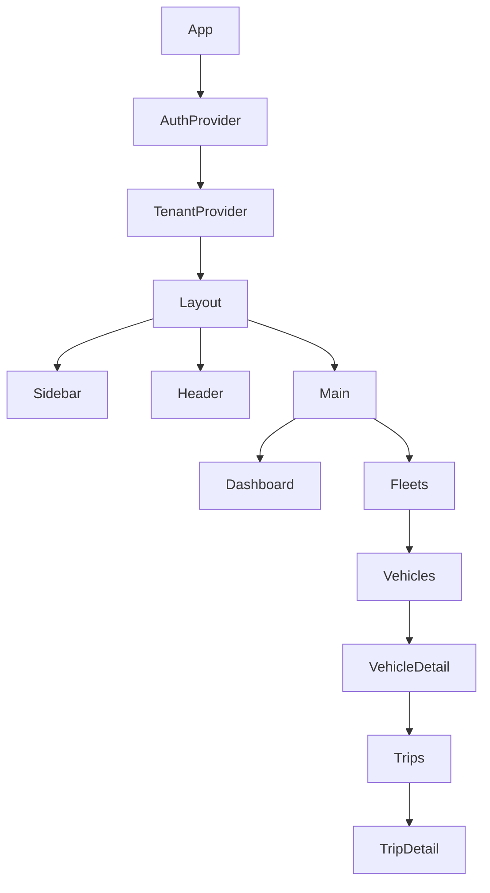

# OnPoint UI Specification & Migration Plan

## 1. Purpose
This document defines the authoritative UI specification for the **OnPoint Fleet & Telematics Platform**, targeting a modern **React SPA** while reusing the existing Angular UI theme, stylesheets, and interaction paradigms. It also introduces **industry‑standard multi‑tenancy UX**, which is currently missing in the legacy UI.

---

## 2. Target Architecture
- **Frontend**: React (SPA)
- **Auth**: AWS Cognito (External IdP, JWT-based)
- **Backend**: Serverless APIs (API Gateway + Lambda)
- **Deployment**: S3 + CloudFront (multi‑domain, multi‑tenant)
- **State Management**: React Query + Context (auth/tenant scope)

---

## 3. Multi‑Tenancy UX Model (Industry Standard)

### 3.1 Roles
| Role | Scope | Capabilities |
|----|----|----|
| Platform Admin | Global | Manage tenants, billing, platform settings |
| Tenant Admin | Tenant | Users, fleets, vehicles, drivers |
| Tenant User | Tenant | View dashboards, trips, alerts |

### 3.2 Tenant Context UX
- Persistent **Tenant Selector** (top-left)
- Tenant context drives:
  - API headers
  - Data filtering
  - Navigation visibility
- Tenant switch triggers full data reload

### 3.3 Fleet Context UX
- Optional Fleet Selector (visible to Tenant Admin / Fleet Manager)
- Cascades: Tenant → Fleet → Vehicle → Trip

---

## 4. Core Screens

### 4.1 Platform Admin
- Tenant List
- Create / Suspend Tenant
- Tenant Metrics Overview

### 4.2 Tenant Admin
- Dashboard (KPIs)
- Fleet Management
- Vehicle Registry
- Driver Management
- User & Role Management
- VIN Assignment & History

### 4.3 Operations
- Live Map
- Vehicle State
- Trip History
- Trip Events (raw + normalized)
- Alerts & Geofencing

---

## 5. Vehicle → Driver → Trip UX
- Fleet overview → Vehicle list → Vehicle detail
- Tabs:
  - Current State
  - Trips
  - Events
  - Drivers
- Trip detail includes:
  - Summary
  - Timeline
  - Raw vs Normalized toggle

---

## 6. Authentication & Authorization UX
- Cognito Hosted UI or Embedded
- First‑login password set
- Role-based navigation
- 403 surfaced as **“Access denied”**, not empty screens

---

## 7. React Component Hierarchy (Mermaid)



---

## 8. Design Token Strategy (Theme Preservation)

### 8.1 Token Layers
- **Base Tokens**: colors, fonts (from existing CSS)
- **Semantic Tokens**: primary, danger, background
- **Component Tokens**: buttons, cards, tables

### 8.2 Migration Strategy
1. Freeze legacy CSS
2. Extract tokens into CSS variables
3. Wrap React components using tokens
4. Gradually replace legacy selectors

---

## 9. GitHub Copilot Prompt – UI Migration

```
You are a senior frontend architect.

Review the existing Angular UI source code and stylesheets.
Create a React SPA that:
- Preserves visual theme and UX behavior
- Uses AWS Cognito for authentication
- Implements multi‑tenant UX (platform admin, tenant admin, tenant user)
- Uses tenant and fleet context consistently
- Calls existing OnPoint APIs
- Separates raw vs normalized telemetry views
- Uses React Query for API calls
- Uses design tokens instead of hard‑coded CSS
- Produces clean, testable components

Output:
- React component structure
- Key screens and routes
- Reusable layout components
- Migration notes per screen
```

---

## 10. Non‑Goals
- Rewriting backend APIs
- Hardcoding tenant logic in UI
- Breaking existing visual identity

---

## 11. Success Criteria
- UI supports full multi‑tenancy
- Legacy theme preserved
- React codebase ready for mobile (React Native)
- Clear migration path for future design refresh
