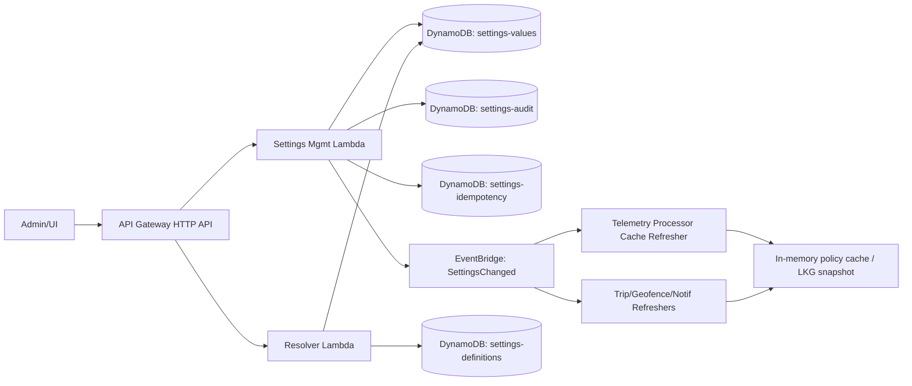
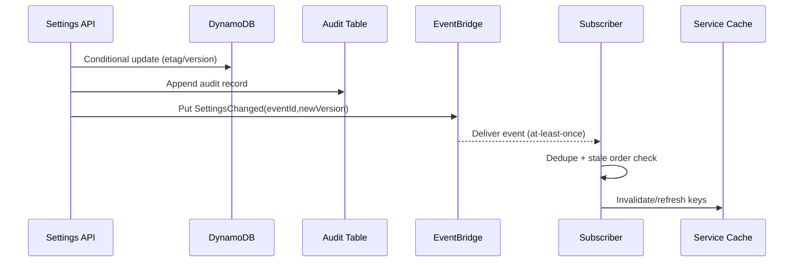
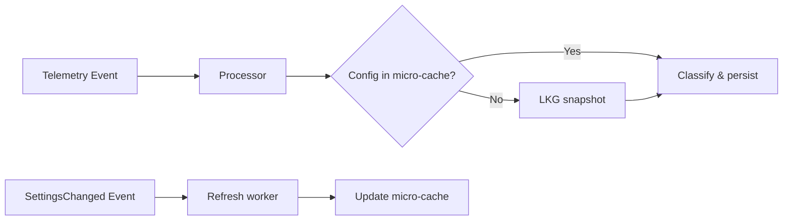

# OnPoint Settings Feature — Implementation Guide (Version 2.2)

## 1. Document Purpose
This guide is the implementation blueprint for the settings-feature-requirements.md v2.1 baseline, hardened through principal-level architecture review for production telematics SaaS scale.

This document is normative for backend, UI, SRE, DevSecOps, and data platform teams.

## 2. Architecture Review Conclusions (v2.2)
### 2.1 Validation Outcomes
1. Resolver-in-hot-path prohibition is retained and enforced.
2. Current design is directionally sound for serverless operation, but requires stricter controls for event replay, restore atomicity orchestration, and scale guardrails.

### 2.2 Priority Hardening Areas
1. Event propagation idempotency and stale-order handling.
2. N+1 read amplification prevention in resolver/profile endpoints.
3. Snapshot restore safety under partial failure.
4. DynamoDB partition strategy at 100k+ and 1M vehicle scale.
5. Explicit AWS quota management plan.

## 3. Implementation Principles
1. Single authoritative resolver behavior via shared library/contract.
2. Hard multi-tenant isolation in API, data, cache, logs, metrics.
3. Telemetry hot path must remain non-blocking and resolver-independent.
4. Safe writes by default: idempotency + optimistic concurrency + policy validation.
5. Append-only audit with integrity controls.
6. Progressive rollout with feature flags and rollback playbooks.

## 4. Target Architecture (AWS Serverless)
### 4.1 Core Components
1. API Gateway HTTP API (preferred) for settings APIs.
2. Lambda: Settings Management API.
3. Lambda: Settings Resolver API.
4. DynamoDB:
   - onpoint-settings-definitions
   - onpoint-settings-values
   - onpoint-settings-audit
   - onpoint-settings-idempotency
   - optional onpoint-settings-event-dedupe
5. EventBridge bus for `SettingsChanged` events.
6. Consumer refresh handlers in telemetry, trip, geofence, notification services.
7. CloudWatch metrics, alarms, dashboards.

### 4.2 Optional Components (NOT default)
1. Redis/DAX only when measured p95/p99 and cost justify.
2. Audit hash-chain verifier (scheduled job).

### 4.3 Architecture Diagram

## 5. Work Breakdown Structure
### Phase A — Foundation
1. Create tables, indexes, TTL policies, and IAM least-privilege policies.
2. Implement shared settings SDK (resolver, validation, idempotency, concurrency helpers).
3. Implement authz middleware with tenant boundary and role claims checks.

### Phase B — APIs and Resolver
1. Build management APIs (CRUD, bulk, snapshots, impact-analysis).
2. Build resolver APIs (single-key, profile) with bounded fan-out.
3. Implement dependency graph validation and cycle rejection.
4. Implement cross-setting validation engine with structured error payloads.

### Phase C — Propagation and Integrations
1. Emit `SettingsChanged` with deterministic event schema.
2. Add idempotent subscriber cache refresh workers.
3. Add telemetry micro-cache and periodic refresh fallback.

### Phase D — UI/UX
1. Implement tenant/fleet/user settings.
2. Implement audit timeline, scheduled changes, resolver inspector.
3. Implement impact analysis panel and cross-key error rendering.

### Phase E — Hardening and Rollout
1. Shadow mode and parity telemetry.
2. Canary + tenant cohort rollout.
3. SLO validation and game-day drills.

## 6. Data Model and DynamoDB Access Patterns
### 6.1 Table: onpoint-settings-definitions
#### Access patterns
1. Get definition by key.
2. List definitions by category/version/deprecation state.

#### Keys
- PK: `SETTING#{settingKey}`
- SK: `META#{version}`

#### Required attributes
- settingKey, category, dataType, validationSchema
- systemDefaultValue, defaultVersion
- supportsLock, supportsFutureEffectiveFrom
- dependsOn[], affects[]
- introducedVersion, deprecationState

### 6.2 Table: onpoint-settings-values
#### Access patterns
1. Get key by specific scope.
2. List scope settings (tenant/fleet/user).
3. Batch read resolver scope chain.

#### Keys
- PK: `TENANT#{tenantId}#SCOPE#{scopeType}#{scopeId}`
- SK: `SETTING#{settingKey}`

#### Attributes
- tenantId, scopeType, scopeId, settingKey
- value, valueType, version, etag
- lockedAtTenant, effectiveFrom
- updatedAt, updatedBy, changeReason

#### Constraints
1. Conditional write required (`etag`/`version`).
2. Stale write returns `412`.
3. No table scans in request path.

### 6.3 Table: onpoint-settings-audit
#### Access patterns
1. Query by tenant + key + time range.
2. Export by scope/date window.

#### Keys
- PK: `TENANT#{tenantId}#SETTING#{settingKey}#BUCKET#{yyyyMM}`
- SK: `TS#{iso8601}#REQ#{requestId}`

#### Attributes
- eventId, tenantId, scopeType, scopeId, settingKey
- oldValue, newValue, changedBy, changedAt, requestId
- idempotencyKey, etagBefore, etagAfter, reason
- optional previousHash, entryHash

#### Compliance constraints
1. Append-only; no update/delete APIs.
2. Legal hold support for retention exceptions.

### 6.4 Table: onpoint-settings-idempotency
#### Access pattern
1. Deduplicate repeated writes.

#### Keys
- PK: `TENANT#{tenantId}#IDEMPOTENCY#{idempotencyKey}`
- SK: `OP#{operationType}#{resourceHash}`

#### Attributes
- requestHash, statusCode, responsePayload
- createdAt, expiresAt (TTL)

### 6.5 Optional Table: onpoint-settings-event-dedupe
Use for subscriber-side event replay protection.

#### Keys
- PK: `SUBSCRIBER#{serviceName}#TENANT#{tenantId}`
- SK: `EVENT#{eventId}`

## 7. Resolver Implementation and Read Amplification Controls
### 7.1 Resolver Algorithm
1. Validate tenant/fleet/user relationship and claims.
2. Load relevant definitions once per request context.
3. Batch-read scoped values for requested keys (no per-key network calls).
4. Resolve precedence chain (`user`, `fleet`, `tenant`, `system`).
5. Apply lock/effectiveFrom/deprecation semantics.
6. Return deterministic payload with provenance metadata.

### 7.2 N+1 Prevention Rules (Mandatory)
1. Profile endpoint **MUST** batch by scope, not by key.
2. Dependency validation **MUST** operate on pre-fetched candidate map.
3. Resolver **MUST NOT** call DynamoDB once per setting key.

### 7.3 Resolver Endpoint Budget
1. Single-key endpoint target: <= 3 DynamoDB reads typical.
2. Profile endpoint target: bounded by scope rows + one definitions fetch.

## 8. Dependency Graph and Cross-Setting Validation
### 8.1 Dependency Graph
1. Maintain directed graph from `dependsOn`.
2. On definition updates, run cycle detection (Kahn/DFS).
3. Reject cycles with structured `400` including cycle path.

### 8.2 Cross-Setting Validation
1. Validate against post-change candidate effective state.
2. Return `400` with:
   - `errorCode`
   - `message`
   - `violations[]` including `ruleId`, `settingKeys[]`, `actual`, `expected`
3. Version all rules and include `ruleVersion` in error output.

## 9. API Implementation Details
### 9.1 Required Headers
1. `Authorization`
2. `x-tenant-id` (must match trusted claims)
3. `Idempotency-Key` for writes
4. `If-Match` for guarded updates/deletes

### 9.2 Endpoints
#### Management
1. GET `/settings/definitions`
2. GET `/settings/{scopeType}/{scopeId}`
3. PUT `/settings/{scopeType}/{scopeId}/{settingKey}`
4. DELETE `/settings/{scopeType}/{scopeId}/{settingKey}`
5. POST `/settings/bulk`
6. GET `/settings/audit`
7. POST `/settings/snapshots/export`
8. POST `/settings/snapshots/import`
9. POST `/settings/snapshots/restore`
10. POST `/settings/impact-analysis`

#### Resolver
1. GET `/settings/resolved/{settingKey}`
2. GET `/settings/resolved/profile`

### 9.3 Blast-Radius Protected Writes
1. Critical keys require impact-analysis token.
2. Optional approval gating by policy.
3. Scheduled `effectiveFrom` allowed with validation.

## 10. Event Propagation Reliability
### 10.1 Settings Changed Event Contract
Required fields:
1. `eventId` (UUID)
2. `tenantId`, `scopeType`, `scopeId`
3. `changedKeys[]`
4. `newVersion`
5. `changedAt`
6. `requestId`

### 10.2 Idempotent Subscriber Behavior
1. At-least-once delivery assumed.
2. Subscribers must dedupe by `eventId`.
3. Subscribers must ignore stale events using `newVersion/changedAt` ordering checks.

### 10.3 Propagation SLO
1. 95% subscribers refreshed in < 2s.
2. 99% subscribers refreshed in < 5s.

### 10.4 Propagation Flow

## 11. Telemetry Hot-Path Safety (Critical Constraint)
### 11.1 Required Pattern
1. Telemetry processors use local in-memory micro-cache (TTL 60s default).
2. Refresh via EventBridge `SettingsChanged` and periodic timer.
3. On resolver/cache miss failure, continue with LKG configuration.

### 11.2 Explicitly Prohibited
1. Resolver call per telemetry event.
2. Synchronous network read per GPS point or signal.
3. Blocking ingestion pipeline waiting for resolver availability.

### 11.3 Telemetry Integration Flow

## 12. Snapshot, Export/Import, Restore Safety
### 12.1 Export
1. Signed artifact with checksum and schema version.
2. Include tenant/scope metadata and generation timestamp.

### 12.2 Import
1. Validate signature and schema version.
2. Dry-run mandatory before apply.
3. Report conflicts and validation violations.

### 12.3 Restore (State Safety)
1. Use restore plan object with deterministic operation order.
2. Logical atomicity by staged apply + rollback plan.
3. If partial apply fails, execute compensating actions and mark restore failed.
4. Record full restore audit trail (`restoreId`, before/after hashes).

## 13. Security, Isolation, and Compliance
1. KMS encryption at rest for sensitive values.
2. Sensitive values masked in responses and logs.
3. Tenant context from claims is authoritative.
4. Cross-tenant access attempts blocked and audited.
5. Audit data append-only with optional hash-chain verification.

## 14. Cost and Scale Efficiency
### 14.1 Cost Drivers
1. Resolver/profile reads dominate total cost.
2. Audit write volume grows with config churn and rollout automation.
3. CloudWatch custom metrics cardinality can become material cost.

### 14.2 Cost Controls
1. Prefer HTTP API over REST API when features suffice.
2. Keep DynamoDB on-demand initially; review reserved/auto-scaling if stable load.
3. Avoid default always-on Redis/DAX.
4. Use metric dimensions carefully to avoid cardinality explosion.

## 15. AWS Limits and Quotas to Track
1. Lambda account concurrency and burst concurrency.
2. API Gateway RPS and burst quotas.
3. EventBridge PutEvents and invocation quotas.
4. DynamoDB adaptive capacity and partition-level throttling behavior.
5. CloudWatch PutMetricData and log ingestion limits.

Set alarms and quota dashboards before production launch.

## 16. Scale Readiness (100k+ vehicles)
### 16.1 Load Assumptions
1. 10k vehicles: baseline production launch.
2. 100k vehicles: regional scale target.
3. 1M vehicles: long-term multi-tenant growth scenario.

### 16.2 Expected Characteristics by Scale
#### 10k vehicles
1. In-memory cache + EventBridge invalidation sufficient.
2. On-demand DynamoDB likely cost-efficient.

#### 100k vehicles
1. Increased propagation fan-out and audit growth.
2. Require monthly audit bucketing and strict metric cardinality controls.
3. Mandatory load testing of resolver/profile APIs under peak admin operations.

#### 1M vehicles
1. Strong pressure on event fan-out and cache refresh coordination.
2. May require regional partitioning strategy, async admin jobs, and selective distributed cache.
3. Strict SLO budgets and synthetic probes required.

### 16.3 Read Amplification Guardrails at Scale
1. Hard cap on profile key count per request.
2. Pagination or category-scoped profile requests for very large keyspaces.
3. Avoid resolver profile calls in batch loops; use cached snapshots.

## 17. Observability and Operational Telemetry
### 17.1 Required Metrics
1. `settings_write_success_count`
2. `settings_write_conflict_count`
3. `settings_resolve_latency_ms` (p50/p95/p99)
4. `settings_cache_hit_ratio`
5. `settings_invalidation_lag_ms`
6. `settings_authz_denied_count`
7. `settings_idempotency_replay_count`
8. `settings_event_replay_dropped_count`
9. `settings_restore_failure_count`

### 17.2 Tracing and Logs
1. Correlation IDs required across API, Lambda, EventBridge consumers.
2. Trace sampling policy must preserve write, restore, and failure paths.
3. Logs must be structured JSON with tenant-safe redaction.

## 18. Feature Flags and Release Controls
1. `settings.resolver.enabled.<service>`
2. `settings.write.enabled.<tenantCohort>`
3. `settings.cache.strategy`
4. `settings.lock.strict`
5. `settings.blastRadius.approval.required`

All flag changes are auditable and linked to change requests.

## 19. UI Implementation Mapping
### 19.1 Core Views
1. Tenant settings
2. Fleet override grid
3. User preferences
4. Audit timeline
5. Scheduled changes
6. Resolver inspector

### 19.2 Critical UI Behaviors
1. Show inherited source + effective value.
2. Show lock state and reason.
3. Show cross-setting validation rule violations.
4. Show impact analysis before guarded saves.
5. Show scheduled effective changes and status.

## 20. Testing Strategy
### 20.1 Unit
1. Resolver precedence/lock behavior.
2. Dependency cycle detection.
3. Cross-setting validation rules.
4. Idempotency replay behavior.

### 20.2 Integration
1. Conditional writes + concurrency conflicts.
2. EventBridge propagation and stale-event handling.
3. Telemetry LKG behavior during resolver outage.
4. Snapshot restore compensation behavior.

### 20.3 Performance
1. Resolver p95/p99.
2. Propagation SLO compliance.
3. Bulk update throughput with tenant fairness.

### 20.4 Security/Isolation
1. Cross-tenant denial tests.
2. Sensitive field redaction tests.
3. Audit immutability and integrity tests.

## 21. Rollout Plan
1. Deploy APIs/tables disabled by feature flags.
2. Seed definitions/defaults.
3. Shadow-read resolver in selected services.
4. Compare parity metrics and drift.
5. Enable writes for pilot cohort.
6. Enable propagation refreshers.
7. Expand tenant coverage progressively.
8. Remove hardcoded config paths.

## 22. Operational Runbooks
1. Resolver outage and degraded-mode operation.
2. Event propagation lag breach handling.
3. Conflict storm (`412`/`409`) mitigation.
4. Snapshot restore emergency procedure.
5. Tenant-isolation incident handling.
6. Event replay/stale ordering incident response.
7. DynamoDB throttling and hot partition mitigation.

## 23. Architectural Risks & Mitigations
1. **Risk**: Event replay applies stale config.
   - **Mitigation**: Dedupe table + version ordering checks.
2. **Risk**: Resolver profile read amplification cost spike.
   - **Mitigation**: batch reads, key caps, category paging, cache hit SLO.
3. **Risk**: Snapshot restore partial corruption.
   - **Mitigation**: staged restore plan, compensating rollback, full audit trail.
4. **Risk**: Cross-tenant leakage in mis-scoped queries.
   - **Mitigation**: tenant-keyed PK design + claim-authoritative authz.
5. **Risk**: Telemetry throughput collapse from resolver dependency.
   - **Mitigation**: hard prohibition + micro-cache + LKG fallback.
6. **Risk**: Audit table growth/cost explosion.
   - **Mitigation**: monthly bucketing, retention policies, export/archive jobs.

## 24. Engineering Deliverables Checklist
1. OpenAPI spec
2. CloudFormation resources
3. Shared resolver SDK
4. Validation rules registry
5. EventBridge contracts
6. UI workflows
7. Dashboards + alarms
8. Migration scripts
9. Runbooks and playbooks

## 25. Definition of Done
1. All acceptance criteria from requirements v2.1 are met.
2. Telemetry path verified to avoid per-event resolver calls.
3. Propagation SLO achieved in staging load tests.
4. Security and isolation gates pass.
5. Snapshot restore drill passes without data corruption.
