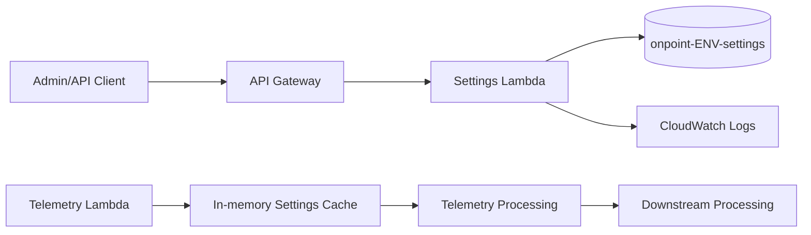
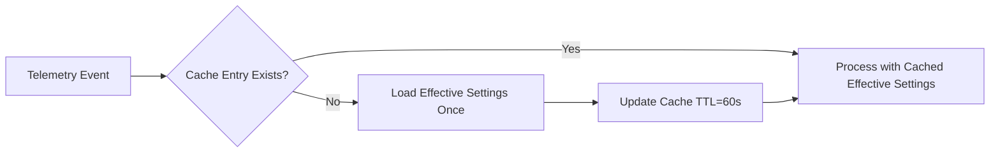

# OnPoint Settings Feature — Implementation Guide (Lean v1)

## 1. Document Purpose
This document is the authoritative implementation specification for the OnPoint Settings feature, redesigned for startup efficiency, low operational cost, and production-grade multi-tenant isolation.

This guide is implementation-ready for backend, platform, and telemetry teams.

## 2. Architectural Principles
1. Keep infrastructure flat and simple for v1.
2. Preserve strict tenant and fleet isolation boundaries.
3. Resolve settings once per cache window, never per telemetry event.
4. Favor deterministic DynamoDB access patterns with no table scans.
5. Use minimal operational components while keeping a forward path to enterprise expansion.

## 3. Scope Hierarchy Model
Settings inheritance order is fixed and authoritative:
1. FLEET override
2. TENANT override
3. PLATFORM default

Supported scopes:
1. PLATFORM
2. TENANT
3. FLEET

## 4. Target Architecture (Lean Serverless)
### 4.1 Core Components
1. API Gateway HTTP API
2. Lambda: Settings API
3. DynamoDB single table: `onpoint-${Env}-settings`
4. Cognito user pool groups for authorization
5. CloudWatch Logs and metrics

### 4.2 Explicit v1 Exclusions
1. No EventBridge cache invalidation requirement.
2. No approval workflow subsystem.
3. No dedicated audit subsystem.
4. No dependency graph or cross-setting policy engine.
5. No resolver invocation in telemetry event hot path.

### 4.3 Architecture Diagram

## 5. Single-Table Data Model
Table name:
- `onpoint-${Env}-settings`

### 5.1 Current Value Items
- PK = `SCOPE#{scopeType}#{scopeId}`
- SK = `SETTING#{key}`

Required attributes:
- scopeType (`PLATFORM` | `TENANT` | `FLEET`)
- scopeId
- key
- value
- valueType
- updatedAt
- updatedBy

### 5.2 Optional Change Log Items
- PK = `SCOPE#{scopeType}#{scopeId}`
- SK = `CHANGE#{timestamp}#SETTING#{key}`

Optional attributes:
- key
- oldValue
- newValue
- changedAt
- changedBy
- reason

### 5.3 Access Patterns
1. Read all settings for one scope.
2. Read one setting key for one scope.
3. Write/update one setting key for one scope.
4. Delete one setting key for one scope.
5. Optionally read recent changes for one scope.

### 5.4 Access Constraints
1. Query by PK only.
2. Point read by PK+SK for single-key operations.
3. No Scan operations in request path.
4. No per-event DynamoDB reads in telemetry path.

## 6. Effective Resolution Logic
### 6.1 Resolution Inputs
- tenantId (required for tenant/fleet workloads)
- fleetId (optional, if fleet-specific path)

### 6.2 Resolution Order
For each key:
1. Use FLEET value if present.
2. Else use TENANT value if present.
3. Else use PLATFORM value.

### 6.3 Determinism Rules
1. Missing scope entries are valid and fall through to lower-precedence scope.
2. Resolution output includes source scope for traceability.
3. Resolution behavior is side-effect free.

## 7. Telemetry Hot-Path Contract (Critical)
1. Settings must NEVER be resolved per telemetry event via API.
2. Telemetry lambdas must implement in-memory cache.
3. Default cache TTL is 60 seconds.
4. Cache key is tenantId or fleetId.
5. No AppSync resolvers per telemetry event.
6. No DynamoDB reads per telemetry event.
7. No EventBridge invalidation required for v1.

**Settings resolution must be O(1) in telemetry processing via in-memory cache.**

### 7.1 Telemetry Pattern

## 8. API Surface (Simplified)
The API contract for v1 is strictly limited to:

1. `GET /settings/effective?tenantId=&fleetId=`
2. `GET /settings/scopes/{scopeType}/{scopeId}`
3. `PUT /settings/scopes/{scopeType}/{scopeId}/{key}`
4. `DELETE /settings/scopes/{scopeType}/{scopeId}/{key}`

### 8.1 Endpoint Semantics
#### GET /settings/effective
- Returns effective settings map after applying hierarchy.
- Input:
  - tenantId: required for tenant/fleet contexts
  - fleetId: optional
- Response includes:
  - effective values
  - source scope per key

#### GET /settings/scopes/{scopeType}/{scopeId}
- Returns raw settings at one scope only.
- No hierarchy merge.

#### PUT /settings/scopes/{scopeType}/{scopeId}/{key}
- Upserts one setting value.
- Type validation required.

#### DELETE /settings/scopes/{scopeType}/{scopeId}/{key}
- Deletes one scoped override.
- Effective value falls back to lower-precedence scope.

## 9. Validation Model (v1)
### 9.1 Mandatory Validation
1. Type validation for all settings keys.

### 9.2 Optional Validation
1. Per-key min/max validation for selected critical keys.

### 9.3 Explicit Non-Goals (v1)
1. No cross-setting dependency engine.
2. No global policy graph execution.
3. No multi-key transactional rule evaluation.

## 10. Authorization Model
Authorization is group-based via Cognito claims.

### 10.1 Roles
1. PlatformAdmin: full read/write across all scopes.
2. TenantAdmin: read/write within assigned tenant and its fleets.
3. FleetManager: read-only within assigned fleet/tenant boundary.

### 10.2 Enforcement Rules
1. Scope ownership validation is mandatory on every request.
2. TenantAdmin cannot write PLATFORM scope.
3. FleetManager cannot perform write/delete operations.
4. Denied requests are logged with principal and target scope metadata.

## 11. Multi-Tenant Isolation Model
1. Tenant boundary is enforced in API authorization and data access filter logic.
2. Cross-tenant scope access is denied by default.
3. Fleet scope records are always associated with a parent tenant context.
4. Operational logs must include tenantId for incident triage while avoiding sensitive value exposure.

## 12. Observability (Lean)
### 12.1 Minimal Operational Logging
1. Structured CloudWatch logs for API requests, authorization decisions, and errors.
2. Log fields: requestId, principalId, role, tenantId, fleetId, scopeType, scopeId, key, statusCode, latencyMs.

### 12.2 Optional Change Log
1. Change log may be written to the same table using `CHANGE#{timestamp}#SETTING#{key}` items.
2. Intended for lightweight traceability and debugging.
3. Not a dedicated audit subsystem.

### 12.3 Core Metrics
1. settings_api_requests_total
2. settings_api_errors_total
3. settings_effective_resolution_latency_ms
4. telemetry_settings_cache_hit_ratio
5. telemetry_settings_cache_refresh_count

## 13. Startup Efficiency & Cost Control Rationale
This design is intentionally optimized for startup-stage efficiency while remaining compatible with future enterprise expansion.

1. It avoids DynamoDB read amplification by resolving scoped values in bounded queries per cache window, not per telemetry event.
2. It avoids per-event resolver cost by making telemetry processing consume in-memory effective settings.
3. It keeps infrastructure flat by using one Lambda API + one DynamoDB table + CloudWatch only.
4. It removes EventBridge dependency for cache invalidation in v1, reducing both cost and operational complexity.
5. It keeps evolution paths open:
   - Event-driven invalidation can be added later.
   - Dedicated audit pipelines can be introduced later.
   - Advanced validation engines can be layered later.

## 14. Performance and Scale Assumptions
### 14.1 10k Vehicles
1. In-memory cache with 60s TTL is sufficient.
2. API and DynamoDB load remains moderate with bounded reads.

### 14.2 100k Vehicles
1. Cost remains controlled if cache hit ratio stays high.
2. Primary scaling lever is cache efficiency, not resolver fleet growth.

### 14.3 1M Vehicles (Future Target)
1. Design remains viable if telemetry remains cache-first and O(1).
2. Optional enhancements can be added incrementally (event invalidation, advanced caching tiers) without changing core data model.

## 15. Failure Modes and Operational Behavior
1. If settings API is unavailable, telemetry continues using existing in-memory/LKG data until TTL refresh succeeds.
2. If a scoped override is deleted, fallback to next hierarchy level is automatic.
3. If malformed value is submitted, request fails validation and no write occurs.
4. If authorization fails, request is denied and logged.

## 16. Rollout Plan
1. Deploy single-table schema and settings API in staging.
2. Seed PLATFORM defaults.
3. Enable TENANT and FLEET scope updates for admin roles.
4. Integrate telemetry cache loader with 60-second TTL.
5. Validate cache hit ratio and ingestion latency under load.
6. Promote to production cohort by cohort.

## 17. Implementation Deliverables
1. DynamoDB table definition for `onpoint-${Env}-settings`
2. Settings Lambda API implementation
3. Effective resolver service method inside Lambda (request path only)
4. Cognito group-based authz middleware
5. Telemetry cache utility library (tenant/fleet keyed, TTL 60s)
6. Structured logging and core CloudWatch metrics
7. Optional change-log write path in same table

## 18. Definition of Done
1. All four v1 APIs are implemented and tested.
2. Telemetry path performs no per-event API call and no per-event DynamoDB read.
3. Effective settings retrieval is cache-backed and O(1) in telemetry processing.
4. Group-based authorization enforces scope boundaries.
5. Multi-tenant isolation tests pass.
6. Production load test demonstrates stable latency and controlled cost profile.
