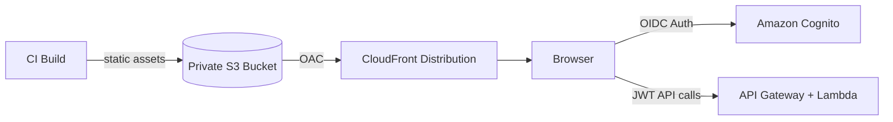

# OnPoint UI Architecture – Production Serverless Specification

## 1) Goals
- MUST deploy the React SPA as a **serverless static site** on AWS.
- MUST integrate UI infrastructure into the **existing nested CloudFormation** stack.
- MUST support **multi-tenant** UX and security requirements.
- SHOULD provide secure, low‑latency global delivery with CDN caching.

## 2) Architecture Overview
**Pattern:** S3 (private) + CloudFront + Origin Access Control (OAC)

**High‑level flow:**
1. Build the SPA into static assets.
2. Upload build artifacts to a private S3 bucket.
3. CloudFront serves the assets globally.
4. SPA routing is handled via CloudFront custom error responses mapping 403/404 to /index.html.

## 3) Authentication & Authorization
- MUST use **Amazon Cognito** (OIDC/JWT) for all UI access.
- MUST NOT use API keys in the browser.
- MUST attach the Cognito access token as Authorization: Bearer for API requests.
- MUST derive tenant identity and role claims from JWT, not from user input.

**JWT claims:**
- tenant identity derived from a tenant claim (example: custom:tenantId).
- roles derived from groups/roles claim (example: cognito:groups or custom:roles).

**Authorization behavior:**
- UI MAY hide or disable controls based on role claims, but server-side authorization is authoritative.
- Any tenant or role in the UI is **advisory only**; APIs enforce access.

## 4) Multi‑Tenancy UX & Security
**Tenant resolution strategies:**
- MUST support a **single domain** with tenant switcher.
- MAY support **tenant-specific subdomains** in a future release.

**Security boundary:**
- Tenant isolation MUST be enforced server-side; the UI must never be trusted for access control.
- UI inputs that represent tenant selection MUST be validated server-side.

**UX personas:**
- **Platform Admin**
  - MUST access global tenant list and cross-tenant administration tools.
  - SHOULD see a distinct banner and tenant context indicator.
- **Tenant Admin**
  - MUST manage tenant settings, fleets, users, and access policies within their tenant.
  - SHOULD access audit and operational summaries for their tenant.
- **Tenant User (Fleet Manager / Analyst / Read‑Only)**
  - MUST be restricted to fleet and telemetry views permitted by role.
  - Read‑Only MUST have non‑mutable UI (no create/update actions).

## 5) Runtime Configuration (Critical)
- MUST use **runtime configuration** loaded at app startup.
- MUST NOT require rebuilds for environment changes.

**Pattern:**
- Load /config.json or /env.js during app bootstrap.
- Store API base URLs, feature flags, and tenant behavior in runtime config.

**Why:**
- Enables promoting the same build across dev/stage/prod without rebuilding.
- Reduces operational risk when endpoints or flags change.

## 6) CloudFormation Integration
**Nested template:** cfn/nested/ui.yaml

**Root stack:** includes UiStack nested resource.

**UI nested stack resources:**
- S3 Bucket (private) for SPA assets
- CloudFront OAC
- CloudFront Distribution
- S3 Bucket Policy allowing CloudFront access

## 7) CloudFront & S3 Best Practices
- S3 MUST remain private with OAC only.
- CloudFront MUST enforce HTTPS.

**Caching policy:**
- index.html → Cache-Control: no-cache, must-revalidate
- Hashed JS/CSS assets → Cache-Control: public, max-age=31536000, immutable

**Response headers policy (CloudFront):**
- MUST include CSP
- MUST include HSTS
- MUST include X-Content-Type-Options

## 8) Routing & SPA Behavior
- CloudFront MUST rewrite 403/404 to /index.html.
- React Router MUST handle all client-side navigation.

## 9) Deployment & CI/CD
**Build responsibilities:**
- CI MUST run dependency install and production build.

**Deploy responsibilities:**
- CI MUST upload assets to S3 with appropriate cache-control metadata.
- CI SHOULD invalidate CloudFront when index.html changes.

**Example deployment sequence:**
1. Build artifacts
2. Sync static assets to S3 with cache-control for immutable assets
3. Upload index.html with no-cache
4. Invalidate CloudFront paths / and /index.html

## 10) Observability & Ops
- SHOULD monitor CloudFront metrics (4xx, 5xx, latency, cache hit rate).
- SHOULD define CloudWatch alarms for elevated error rates.
- MAY enable CloudFront access logs and S3 server access logs.

## 11) Future‑Ready Options
- MAY integrate AWS WAF for edge protection.
- MAY enable tenant custom domains (Route53 + ACM + CloudFront aliases).
- MAY adopt a GraphQL or BFF layer without changing the SPA hosting model.

## 12) Serverless Framework Alignment
This architecture is fully serverless on AWS managed services. If wrapping with the Serverless Framework, it MUST:
- Package the SPA dist output to S3
- Provision CloudFront + OAC and bucket policy
- Expose the distribution domain as outputs
